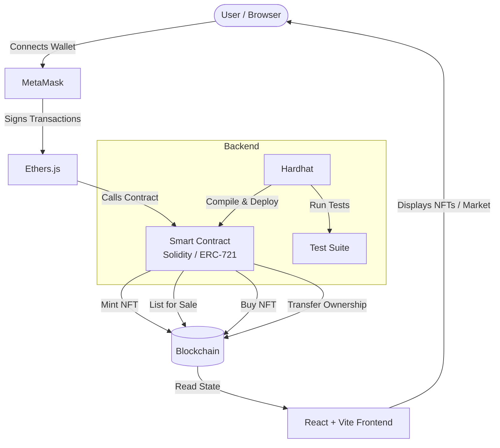

# NFXP — NFT Marketplace

A decentralized NFT Marketplace built with **React + Vite**, **Solidity**, and **Hardhat**. Users can mint, list, buy, and sell NFTs directly on-chain via MetaMask.

🔗 **Live Demo:** [nfxp-one.vercel.app](https://nfxp-one.vercel.app)

---

## How It Works



---

## Key Features

- 🖼️ **Mint NFTs** — Create ERC-721 tokens directly from the UI
- 🏪 **List & Sell** — Put your NFTs up for sale at a custom price
- 🛒 **Buy NFTs** — Purchase listed NFTs; ownership transfers instantly on-chain
- 🔐 **MetaMask Auth** — Wallet-based authentication, no passwords
- ⚡ **Vite Frontend** — Fast HMR dev experience with React
- 🧪 **Hardhat Tests** — Smart contract test suite included
- 🚀 **Vercel Deployed** — Frontend auto-deployed on every push

---

## Tech Stack

| Layer | Technology |
|---|---|
| Frontend | React, Vite |
| Blockchain | Solidity (ERC-721), Hardhat |
| Wallet | MetaMask, Ethers.js |
| Deployment | Vercel (frontend), Hardhat Ignition (contracts) |

---

## Getting Started

### Prerequisites

- Node.js `>= 18`
- MetaMask browser extension
- Git

### 1. Clone the repo

```bash
git clone https://github.com/ryzen-xp/NFXP.git
cd NFXP
```

### 2. Install dependencies

```bash
npm install
```

### 3. Start a local blockchain

```bash
npx hardhat node
```

### 4. Deploy smart contracts

In a new terminal:

```bash
npx hardhat run scripts/deploy.js --network localhost
```

> Copy the deployed contract address(es) and update them in your frontend config/constants file.

### 5. Run the frontend

```bash
npm run dev
```

Open [http://localhost:5173](http://localhost:5173) in your browser.

### 6. Connect MetaMask

Add a custom network in MetaMask:

| Field | Value |
|---|---|
| Network Name | Hardhat Local |
| RPC URL | `http://127.0.0.1:8545` |
| Chain ID | `31337` |
| Currency | ETH |

Import one of the test accounts printed by `npx hardhat node` using its private key.

---

## Running Tests

```bash
npx hardhat test
```

---

## Project Structure

```
NFXP/
├── contracts/          # Solidity smart contracts (ERC-721)
├── ignition/modules/   # Hardhat Ignition deployment modules
├── scripts/            # Deployment scripts
├── test/               # Contract test suite
├── src/                # React frontend source
├── public/             # Static assets
├── artifacts/          # Compiled contract ABIs
├── hardhat.config.js   # Hardhat configuration
└── vite.config.js      # Vite configuration
```

---

## License

MIT
